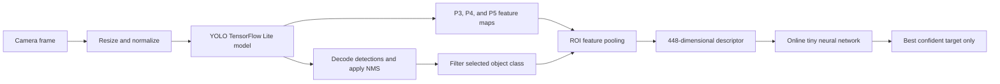

# User-Selected Object Tracking

[](LICENSE)
[](mobile/flutter)
[](https://ai.google.dev/edge/litert)

An experimental object-tracking system that lets a user select one detected object, learn its appearance online, and recognize that same target in subsequent frames.

The repository contains Python benchmark notebooks for three target-association strategies and a complete Flutter implementation designed to run locally on a mobile device. The mobile pipeline combines YOLO detections, multi-scale visual features, and a small classifier trained during the application session.

> This is a research and demonstration project. It is not intended to be used as a biometric identification system or as a safety-critical tracking solution.

## Project Goals

Conventional object detectors answer questions such as “where is a person?” or “where is a dog?”. They do not determine which detected instance was selected by the user.

This project adds a target-specific stage on top of object detection:

1. Detect objects in the camera frame.
2. Filter detections by the selected object class.
3. Let the user choose one instance.
4. Collect multi-scale features for that instance.
5. Train a lightweight classifier on the device.
6. Evaluate future candidates and display only the best confident match.

The target is session-specific. No fixed database of people or object identities is required.

## Implemented Approaches

The notebooks compare three ways to preserve the identity of a user-selected target.

| Approach | Main idea | Role in the repository |
| --- | --- | --- |
| ByteTrack | Associates detections over time using detection confidence and motion/overlap information | Tracking baseline |
| Cosine similarity | Compares the current visual descriptor with descriptors collected from the selected target | Feature-matching baseline |
| Tiny neural network | Trains a compact binary classifier online from target and background descriptors | Main learned target-recognition approach |

The Flutter application implements the tiny-network approach and performs camera processing outside the UI isolate.

## Repository Structure

```text
user-selected-object-tracking/
├── LICENSE
├── README.md
├── notebooks/
│   ├── ByteTrack_Benchmark.ipynb
│   ├── Cosine_Similarity_Benchmark.ipynb
│   └── Tiny_Network_Benchmark.ipynb
└── mobile/
    └── flutter/
        ├── assets/
        │   └── models/
        │       └── user_selected_object_yolo_p3_p4_p5.tflite
        ├── lib/
        ├── test/
        ├── target_detector.ipynb
        ├── convert_to_tflite.py
        └── pubspec.yaml
```

### Benchmark notebooks

- `ByteTrack_Benchmark.ipynb` evaluates detector-based temporal association.
- `Cosine_Similarity_Benchmark.ipynb` evaluates direct similarity between target and candidate descriptors.
- `Tiny_Network_Benchmark.ipynb` evaluates an online-trained binary classifier.

These notebooks are intended both as reproducible experiments and as readable references for the algorithms used by the mobile application.

### Flutter application

The Flutter project provides the complete interactive workflow:

- live camera input;
- TensorFlow Lite object detection;
- selection of an object category;
- tap-to-select target interaction;
- online target learning;
- single-target recognition;
- one bounding box at a time;
- background inference with Dart isolates.

## System Pipeline



The detector and feature extractor are shared. The target-specific model is intentionally small so it can be trained during a mobile session without retraining or replacing the base detector.

## Model Interface

The bundled TensorFlow Lite model accepts one normalized RGB image:

```text
Input
  image: [1, 320, 320, 3], float32

Outputs
  yolo_raw: [1, 84, 2100], float32
  p3:       [1, 64, 40, 40], float32
  p4:       [1, 128, 20, 20], float32
  p5:       [1, 256, 10, 10], float32
```

`yolo_raw` contains the object-detector predictions. `p3`, `p4`, and `p5` expose feature maps at different spatial resolutions.

For every candidate bounding box, the application pools the corresponding region from all three maps and concatenates the results:

```text
64 + 128 + 256 = 448 features
```

The descriptor is normalized before it is passed to the online classifier.

## Online Target Classifier

The target classifier is a compact multilayer perceptron:

```text
448 → 256 → 128 → 32 → 1
```

Hidden layers use ReLU activation. The output uses a sigmoid and represents the probability that a candidate belongs to the selected target.

The application gathers descriptors after the user taps a detected object. Target samples are taken from the selected object, while background samples are obtained automatically from other valid candidates. The user does not need to perform a separate negative-target selection step.

Training uses balanced mini-batches so the classifier learns both what the target looks like and what must be rejected. After training, all candidates are scored, but the interface presents only the highest-confidence valid target.

## Why Multi-Scale Features?

Objects can occupy very different areas of a camera frame. The three feature levels provide complementary information:

- `P3` preserves more spatial detail and is useful for smaller objects;
- `P4` captures intermediate visual structure;
- `P5` contains higher-level semantic information.

Combining them gives the small online classifier a richer representation than raw bounding-box coordinates or a single detector confidence score.

## Flutter Architecture

The mobile code follows a feature-oriented clean architecture. Responsibilities are separated so that camera handling, inference, target learning, and presentation can evolve independently.

```text
mobile/flutter/lib/
├── app/
│   ├── domain/          # Entities, contracts, and use cases
│   ├── infrastructure/  # TensorFlow Lite, camera, and data implementations
│   └── presentation/    # Controllers, screens, overlays, and widgets
└── main.dart            # Composition root and application startup
```

The dependency direction points toward the domain layer. UI code does not need to know how TensorFlow Lite tensors are allocated or how the online network is trained.

### Background inference

Camera frames arrive continuously, while image conversion, detector inference, feature pooling, and candidate evaluation are CPU-intensive. Running all of this work on Flutter's UI isolate causes dropped frames and may trigger application-not-responding errors on slower devices.

The application therefore uses a dedicated worker isolate and keeps at most one inference request in flight. New camera frames can be discarded while the worker is busy, which bounds memory usage and favors a responsive interface over processing every frame.

## Requirements

### Benchmarks

- Google Colab or a local Jupyter environment;
- Python 3.10 or newer;
- a TensorFlow/PyTorch environment matching the imports declared by each notebook;
- GPU runtime recommended for detector experiments.

### Mobile application

- Flutter SDK compatible with the version declared by `mobile/flutter/pubspec.yaml`;
- Android Studio or the Android command-line tools;
- Android SDK and a valid NDK installation;
- a physical Android device with camera access recommended.

The project is designed for on-device execution. No inference server is required after dependencies and model assets have been installed.

## Getting Started

### 1. Clone the repository

```bash
git clone https://github.com/bolotkalil/user-selected-object-tracking.git
cd user-selected-object-tracking
```

The repository contains large notebooks and a bundled model, so the initial download may take some time.

### 2. Run a benchmark notebook

Open one of the files from `notebooks/` in Google Colab or Jupyter:

```text
notebooks/ByteTrack_Benchmark.ipynb
notebooks/Cosine_Similarity_Benchmark.ipynb
notebooks/Tiny_Network_Benchmark.ipynb
```

Run the notebook cells in order. Review and update dataset paths, video paths, and runtime settings where indicated by the notebook.

### 3. Run the Flutter application

```bash
cd mobile/flutter
flutter pub get
flutter doctor
flutter run
```

Grant camera permission when the operating system requests it.

For best performance, test a release build on a physical device:

```bash
flutter run --release
```

Debug builds include additional runtime checks and are not representative of final inference speed.

## Using the Application

1. Launch the application and allow camera access.
2. Select an object category, such as `person` or `dog`.
3. Point the camera at the intended object.
4. Tap its bounding box when the target is clearly visible.
5. Keep the target visible while the application collects training examples.
6. Wait for online training to complete.
7. Move the camera or target and verify that only the best confident match is displayed.
8. Reset the learned target before selecting a different instance.

### Selection recommendations

- Select a target whose bounding box is not heavily overlapped by another object.
- Collect examples with small changes in pose, position, scale, and lighting.
- Avoid selecting a tiny or strongly blurred detection.
- Keep visually similar non-target objects in view during learning when possible; they provide useful background examples.
- Retrain after a major change of environment or target appearance.

## Converting the Model to TensorFlow Lite

The Flutter directory includes conversion resources:

```text
mobile/flutter/target_detector.ipynb
mobile/flutter/convert_to_tflite.py
```

The exported model must preserve the four-output contract used by the application:

```text
yolo_raw, p3, p4, p5
```

After conversion, validate every tensor name, shape, layout, and data type before replacing the bundled asset. A model that returns ordinary post-NMS detections without the three feature maps cannot provide the descriptor required by the online classifier.

Place the validated model at:

```text
mobile/flutter/assets/models/user_selected_object_yolo_p3_p4_p5.tflite
```

Then confirm that it remains declared under `flutter.assets` in `pubspec.yaml`.

## Testing and Static Analysis

From the Flutter project directory, run:

```bash
cd mobile/flutter
flutter analyze
flutter test
```

For performance investigation, use profile mode:

```bash
flutter run --profile
```

Measure inference latency on the intended device. Emulator performance and debug-mode performance can differ significantly from a release build on physical hardware.

## Troubleshooting

### Android build reports a missing `source.properties`

The selected Android NDK installation is incomplete or corrupted. Remove that specific broken NDK version through Android Studio's SDK Manager, reinstall it, and make sure the project's configured NDK version matches the installed package.

### The application is slow or becomes unresponsive

- Use a physical device and a release or profile build.
- Verify that inference is running in the worker isolate.
- Keep only one frame in flight and discard stale frames.
- Avoid copying large tensors more often than necessary.
- Confirm that the model input remains `320 × 320`.
- Check memory and thermal throttling with Android profiling tools.

### A different instance is classified as the target

- Retrain with the intended target centered and clearly visible.
- Include visually similar alternatives in the scene during sample collection.
- Increase target acceptance strictness if false positives are more costly than missed detections.
- Reset the session after large changes in pose, clothing, illumination, or viewpoint.

The online classifier distinguishes appearance descriptors; it does not establish a person's real-world identity.

### Tensor shape or buffer errors

Inspect the model with a TensorFlow Lite interpreter and compare its input/output metadata with the interface documented above. Buffer length must be calculated from the actual tensor shape rather than assumed from an earlier export.

## Current Limitations

- Learning is session-based and is not intended as permanent identity enrollment.
- Similar-looking objects can produce false positives.
- Long occlusions and extreme viewpoint changes remain difficult.
- Detection quality limits tracking quality.
- Online training quality depends on the diversity and correctness of collected samples.
- Performance varies by device, TensorFlow Lite delegate, camera format, and thermal state.
- The current mobile implementation focuses on one selected target at a time.

## Privacy and Responsible Use

The mobile pipeline is designed to operate locally, which avoids requiring camera frames to be sent to a remote inference service. Application developers should still:

- obtain meaningful consent before recording or tracking people;
- comply with local privacy and surveillance laws;
- avoid covert or discriminatory use;
- disclose whether images or learned parameters are stored;
- delete session data when it is no longer needed;
- perform an independent security and privacy review before deployment.

## Contributing

Issues and pull requests are welcome. A useful contribution should:

1. describe the problem or experiment clearly;
2. keep domain logic independent from Flutter widgets and infrastructure details;
3. include tests for changed behavior where practical;
4. pass `flutter analyze` and `flutter test` for mobile changes;
5. document model-interface changes, including tensor shapes and preprocessing;
6. avoid committing generated build artifacts.

For benchmark changes, include the experiment configuration and enough information to reproduce the result.

## License

This project is licensed under the [Apache License 2.0](LICENSE). You may use, modify, and redistribute the project under the terms of that license. Preserve the required copyright and license notices when distributing modified or unmodified copies.

Third-party models, datasets, libraries, and media may have their own licenses and usage conditions. Review those terms separately before redistribution or commercial use.

## Author

Developed by [Bolot Kalil](https://github.com/bolotkalil).
